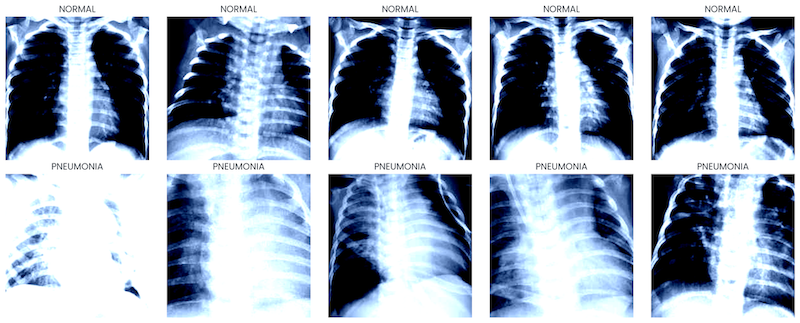

# classifying-x-ray-images-using-pytorch

## Overview

Pneumonia is a common respiratory infection that can be life-threatening if not diagnosed and treated promptly. Chest X-ray images are an essential tool for detecting pneumonia, but manual analysis can be time-consuming and subjective. This project demonstrates how to leverage a pre-trained ResNet-50 model to automatically classify chest X-rays into two categories: **NORMAL** and **PNEUMONIA**.

By fine-tuning the final layers of a pre-trained convolutional neural network, we can build a model that quickly and accurately identifies pneumonia from chest X-ray images. This approach utilizes transfer learning, which allows us to start from weights pre-trained on a large, general dataset (ImageNet), significantly speeding up training and improving the quality of the results.

## Key Features

1. **Pre-Trained Model (ResNet-50):**  
   Uses the ResNet-50 architecture pre-trained on ImageNet. This provides a strong baseline and faster convergence.

2. **Transfer Learning & Fine-Tuning:**  
   Only the final layer of the network is retrained, reducing the computational cost and the amount of required training data.

3. **Data Augmentation & Normalization:**  
   Applies transformations and normalization consistent with the ResNet-50 input domain. Horizontal flipping is used to improve model robustness.

4. **Efficient Training Loop With Early Stopping:**  
   Includes a validation set to monitor model performance and trigger early stopping when the model no longer improves, preventing overfitting.

5. **Performance Metrics:**  
   Measures accuracy and F1-score on the test set to provide a comprehensive view of the model’s classification performance.

## Data Description

The dataset used for this project consists of chest X-ray images organized into the following structure:

- `data/chestxrays/train`  
- `data/chestxrays/val`  
- `data/chestxrays/test`

Each folder contains two subfolders: `NORMAL` and `PNEUMONIA`. The provided dataset has been pre-split and resized to 224x224 pixels:

- **Training Set:** 200 images (100 NORMAL, 100 PNEUMONIA)
- **Validation Set:** 100 images (50 NORMAL, 50 PNEUMONIA)
- **Test Set:** 100 images (50 NORMAL, 50 PNEUMONIA)

Before training begins, the code automatically creates the `val` folder by randomly selecting images from the training set.

**Sample images:**

A few example images from each category are shown below (from `x-rays_sample.png`):



## Requirements

- Python 3.7 or higher
- PyTorch and TorchVision  
- TorchMetrics  
- A GPU or MPS-enabled device is recommended for faster training, but CPU training is also supported.

**Installation of dependencies:**

```bash
pip install torch torchvision torchmetrics
```

## Code Structure

- **Data Loading:**  
  - Uses `ImageFolder` and `DataLoader` to handle image directories.  
  - Normalizes images according to the statistics of the original ImageNet dataset used for training ResNet-50.

- **Model Preparation:**  
  - Loads a pre-trained ResNet-50 model (`ResNet50_Weights.IMAGENET1K_V2`).  
  - Freezes the model’s convolutional layers and replaces the final fully connected layer with a single output neuron for binary classification (normal vs. pneumonia).

- **Training and Validation:**  
  - Utilizes a custom training loop that measures loss and accuracy at each epoch.  
  - Employs a validation set to monitor performance and uses early stopping after a set number of epochs without improvement.  
  - Reduces the learning rate when validation loss plateaus using `ReduceLROnPlateau`.

- **Evaluation:**  
  - Evaluates the final model on the test set, computing Accuracy and F1-score.  
  - Loads the best model checkpoint saved during training for evaluation.

## Results

At the end of training, the model prints the best validation loss and triggers early stopping when no improvement is detected. For the given dataset, the final results are reported as:

- **Test Accuracy:** ~0.810 (81.0%)
- **Test F1-Score:** ~0.838 (83.8%)

These scores indicate the model performs well in distinguishing pneumonia-affected lungs from normal lungs.

## How to Run

1. **Prepare the Dataset:**  
   Ensure the dataset is placed in `data/chestxrays/` with the train/test split:
   ```
   data/chestxrays/train/NORMAL
   data/chestxrays/train/PNEUMONIA
   data/chestxrays/test/NORMAL
   data/chestxrays/test/PNEUMONIA
   ```
   The script will create a `val` folder automatically by moving images from `train`.

2. **Install Dependencies:**  
   ```bash
   pip install torch torchvision torchmetrics
   ```

3. **Run the Code:**  
   Simply run the provided Python notebook. Training, validation, and testing will start automatically. Once training is complete, the best model weights are saved as `model.pth`.

4. **Results:**  
   After training, the script prints out the accuracy and F1-score of the best model on the test set.

## Customization

- **Hyperparameters:**  
  - Adjust the learning rate, batch size, and number of epochs in the script as desired.
- **Data Augmentation:**  
  - Add or modify transformations in `train_transform` or `val_test_transform`.
- **Model Architecture:**  
  - Experiment with different pre-trained models (e.g., DenseNet, EfficientNet) by making minimal changes to the code.

## Troubleshooting

- **Insufficient GPU Memory:**  
  Lower the batch size if encountering memory issues.
- **Convergence Issues:**  
  Adjust learning rate, use different schedulers, or add more augmentation.

## License

MIT.
